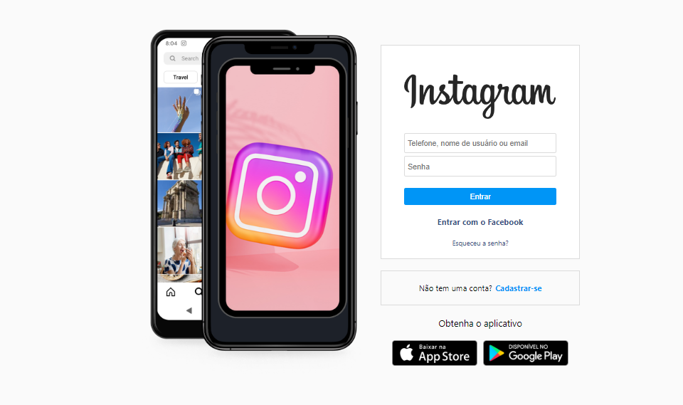
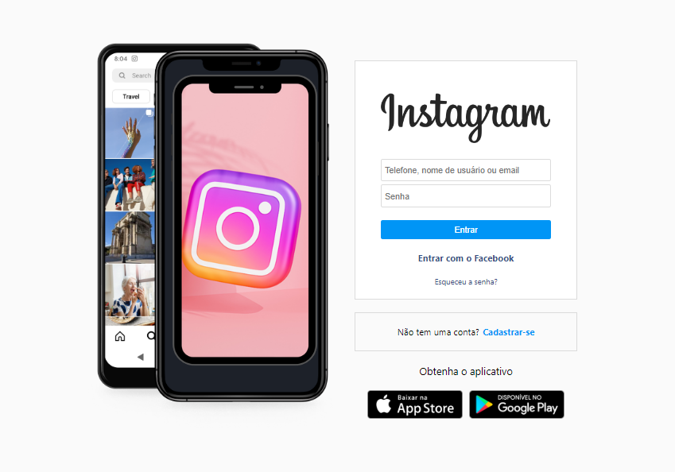

#### Projeto clone instagram projeto desenvolvido durante a semana programação do Zero com o Mentor <a href="https://www.youtube.com/c/RodolfoMori"> Rodolfo Mori</a>

<a href="https://clone-instagram-topaz.vercel.app/">Deploy</a>

#### Nesse projeto procurei fazer minhas alterações tais como HTML semântico, CSS responsivo e para adiconar eventos de trocas de imagens javascript.

[]
[]

 
 

  
  

